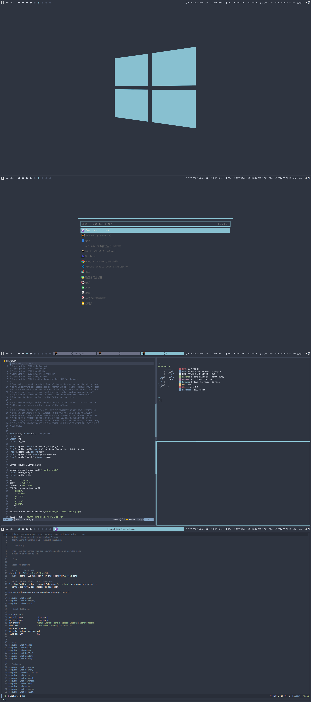
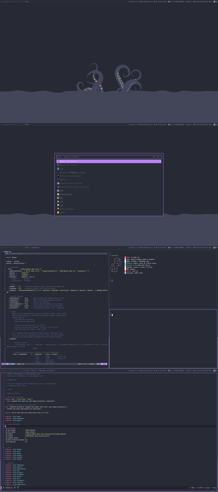
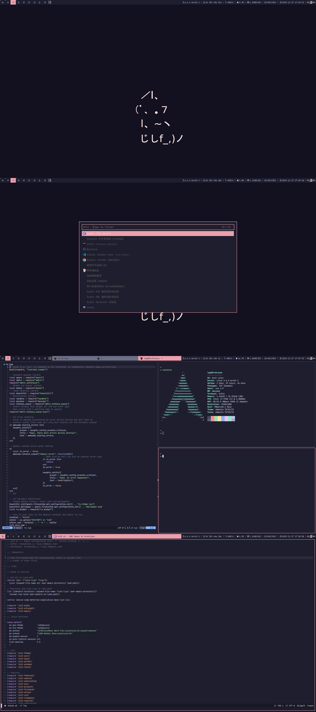
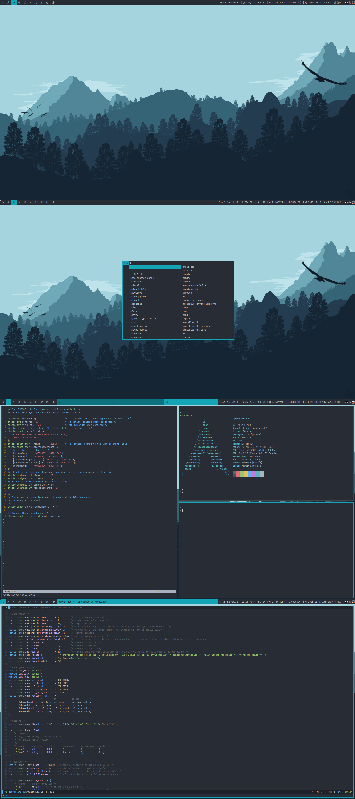

# dotfiles

## qtile

- **WindowManager**: qtile
- **Bar**: qtile bar
- **Launcher**: rofi
- **Terminal**: kitty
- **Editor**: emacs/neovim
- **Shell**: zsh

## xmonad

- **WindowManager**: xmonad
- **Bar**: xmobar
- **Launcher**: rofi
- **Terminal**: alacritty
- **Editor**: emacs/neovim
- **Shell**: zsh

## awesome

- **WindowManager**: awesome
- **Bar**: awesome wibox
- **Launcher**: rofi
- **Terminal**: kitty
- **Editor**: emacs/neovim
- **Shell**: zsh

## dwm
- **WindowManager**: dwm
- **Bar**: dwm bar
- **Launcher**: dmenu
- **Terminal**: st
- **Editor**: emacs
- **Shell**: zsh

